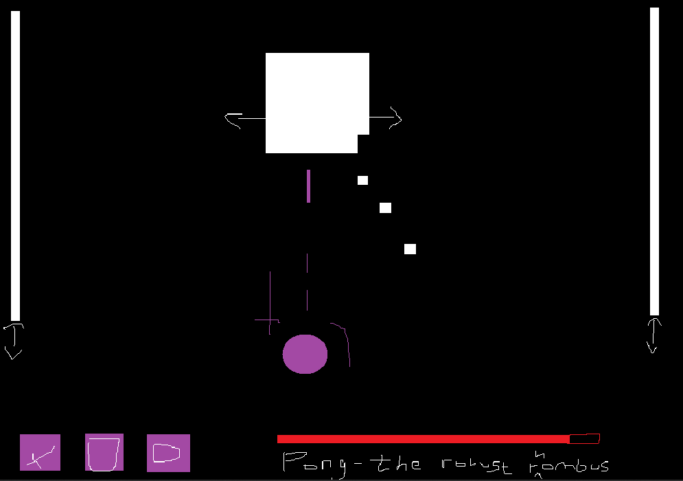

# Blob-Blob: Pong
This game was made for submission to the [Typical Game Jam](https://itch.io/jam/typical-game-jam) where the theme was "Remake Classic (With Your Own Twist)"

### What is the "classic"?
I was deciding between either Pong or Asteroids for the classic to remake as the type of game I could possibly come up with referencing those would fall in-line with the art style of the Blob-Blob series of games I've already made.

### What is your "twist"?
Ultimately, my twist is to fight the ball using in a game of Pong where you must gradually break it down, piece by piece.

### Concept Art

